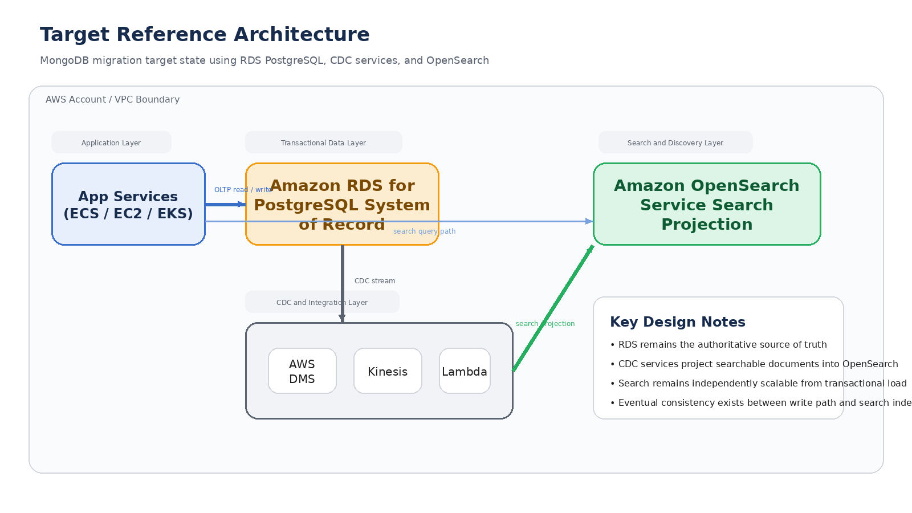
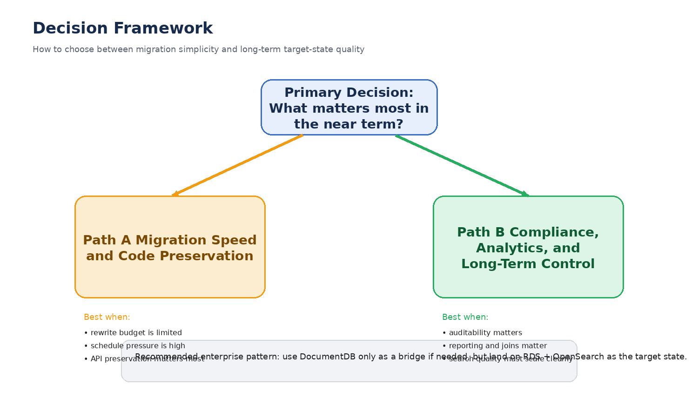
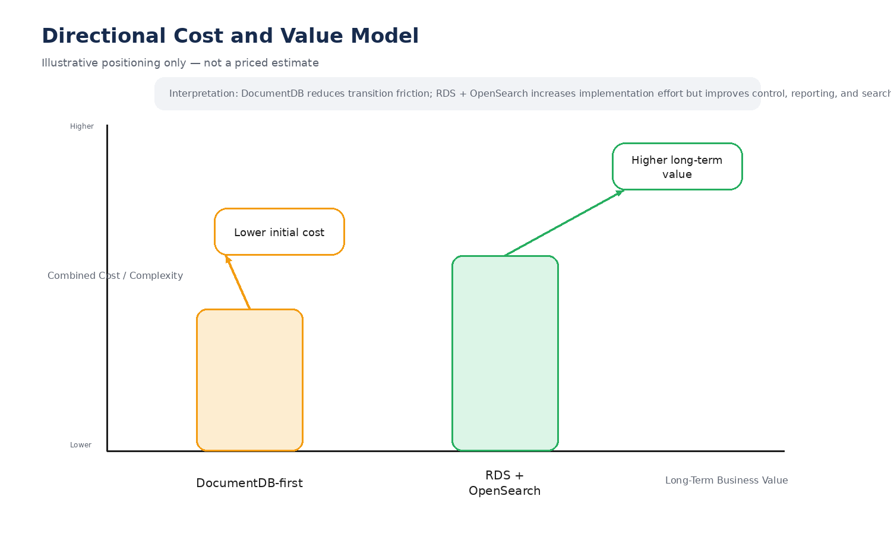

# ADR-001: MongoDB to AWS Migration

## Executive Summary

This ADR recommends migrating MongoDB workloads to an AWS-native polyglot architecture using **Amazon RDS for PostgreSQL** as the system of record and **Amazon OpenSearch Service** as the search layer. **Amazon DocumentDB** may be used as a transitional bridge when migration simplification is the dominant near-term requirement.

## Executive Visuals

### Target Reference Architecture

### Decision Framework

### Directional Cost and Value Model

## Decision Drivers

- Regulatory compliance and auditability
- Full-text search quality and flexibility
- Backup and restore maturity
- Data governance and reporting capability
- Migration speed versus long-term target-state quality

## Recommendation

- **Target state:** RDS PostgreSQL + OpenSearch
- **Bridge option:** DocumentDB, only when migration friction is the primary concern

## Migration Roadmap

1. Assess the MongoDB footprint and search usage patterns.
2. Design the RDS target model and OpenSearch projection model.
3. Stand up the AWS data, CDC, and search stack.
4. Perform bulk migration plus incremental synchronization.
5. Refactor applications and validate search relevance.
6. Cut over and decommission the legacy platform.
